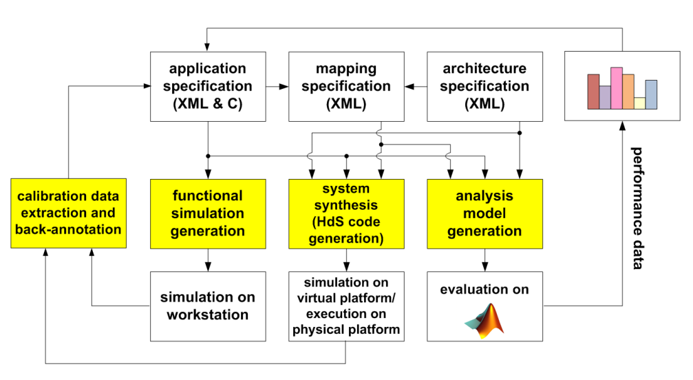
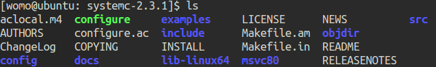
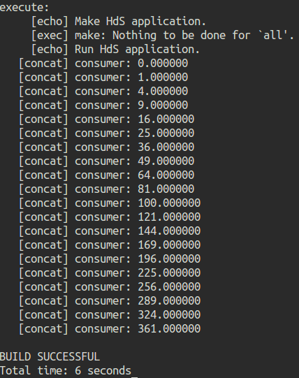

# DOL配置实验文档

---

## Description
The distributed operation layer (DOL) is a software development framework to program parallel applications. The DOL allows to specify applications based on the Kahn process network model of computation and features a simulation engine based on SystemC. Moreover, the DOL provides an XML-based specification format to describe the implementation of a parallel application on a multi-processor systems, including binding and mapping.



> [更多信息](www.tik.ee.ethz.ch/~shapes/dol.html)

---

## How to install

本次实验配置在VMware下ubuntu14.04虚拟机进行。

#### 1. 安装必要的工具和环境
```sh
$ sudo apt-get update
$ sudo apt-get install ant
$ sudo apt-get install openjdk-7-jdk
$ sudo apt-get install unzip
```
#### 2. 解压文件  
- 在存放`dol_ehz.zip`和`systemc-2.3.1.tgz`的路径下,新建`dol`文件夹
```sh
$ mkdir dol
```
- 解压`dol_ehz.zip`到`dol`文件夹
```sh
$ unzip dol_ethz.zip -d dol
```
- 解压`systemc`
```sh
$ tar -zxvf systemc-2.3.1.tgz
```
#### 3. 编译`systemc`
- 解压后进入`systemc-2.3.1`的目录下
```sh
$ cd systemc-2.3.1
```
- 新建一个临时文件夹`objdir`
```sh
$ mkdir objdir
```
- 进入该文件夹`objdir`
```sh
$ cd objdir
```
- 运行`configure`(能根据系统的环境设置一下参数，用于编译)
```sh
$ ../configure CXX=g++ --disable-async-updates
```
- 编译`systemc`
```sh
$ sudo make install
$ cd ..
$ ls
```
- 编译完`systemc`文件目录如下:   

- 记录`systemc`所在路径
```sh
$ pwd
```
- 如图,这里显示`systemc`所在路径为`/home/womo/systemc-2.3.1`  
  


#### 4. 编译DOL
- 进入`dol`文件夹  
```sh
$ cd ../dol
```
- 修改`build_zip.xml`文件  
```sh
$ vi build_zip.xml
```
- 找到如下语句,配置`systemc`的路径,把`YYY`改成systemc所在路径,也就是`/home/womo/systemc-2.3.1`  
```xml
<property name="systemc.inc" value="YYY/include"/>
<property name="systemc.lib" value="YYY/lib-linux/libsystemc.a"/>
```
> **注意:**对于64位系统的机器,`lib-linux要`改成`lib-linux64`.  

- 编译,若成功会显示`build successful`.
```sh
$ ant -f build_zip.xml
```
- 尝试运行第一个例子:
```sh
$ cd build/bin/main
$ ant -f runexample.xml -Dnumber=1
```
- 成功结果如图:  


---

## Experimental experience

本次实验做的过程中基本没遇到什么问题, TA给的ppt讲解的很详细. 使用了MarkDown编辑器`Typora`, 所见即所得, 体验很不错!
