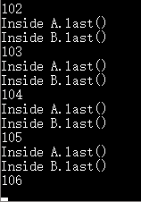
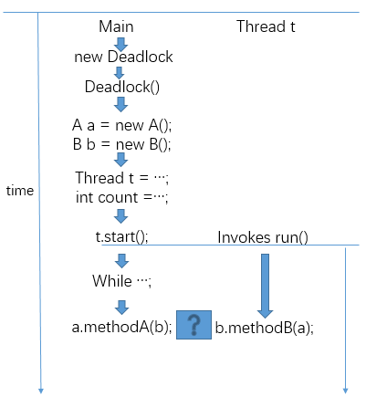

# Deadlock

##  死锁产生测试

- 编写如下代码`Deadlock.java`

  ```java
  class Deadlock implements Runnable {
  	A a = new A();
  	B b = new B();

  	Deadlock() {
  		Thread t = new Thread(this);
  		int count = 20000;
  		t.start();
  		while(count-->0);
  		a.methodA(b);
  	}

  	public void run() {
  		b.methodA(a);
  	}

  	public static void main(String args[]) {
  		new Deadlock();
  	}
  }

  class A {
  	synchronized void methodA(B b) {
  		b.last();
  	}

  	synchronized void last() {
  		System.out.println("Inside A.last()");
  	}
  }

  class B {
  	synchronized void methodA(A a) {
  		a.last();
  	}

  	synchronized void last() {
  		System.out.println("Inside B.last()");
  	}
  }
  ```

- 然后编译java文件

  ```shell
   javac Deadlock.java
  ```

- 编写脚本文件`run.bat`, 重复运行`Deadlock`程序

  ```shell
  cd /d %~dp0
  @echo off
  :start
  set /a var+=1
  echo %var%
  java Deadlock
  if %var% leq 1000 GOTO start
  pause
  ```

- 执行`run.bat`, 结果如下, 在第106次执行`Deadlock`时程序卡住了, 说明发生了死锁.

    

  ​

## 死锁产生原因分析

如下图所示, 主线程启动了子线程`t`后,开始进入了忙等待,而子线程`t`也进入了就绪队列. 现在有如下几种情况:

- 主线程先结束忙等待,调用函数`a.methodA(b)`,在`methodA`函数里调用`b.last()`结束后,释放对象`a`和`b`的锁, 此时子线程`t`才被调度运行调用函数`b.methodB(a)`, 不会被阻塞.
- 子线程`t`先被调度运行, 调用函数`b.methodB(a)`,在`methodB`函数里调用`a.last()`结束后,释放对象`a`和`b`的锁, 此时主线程才结束忙等待,调用函数`a.methodA(b)`不会被阻塞.
- 主线程在结束忙等待,调用函数`a.methodA(b)`, 而**未**在`methodA`函数里调用`b.last()`时, 子线程`t`刚好被调度运行, 调用函数`b.methodB(a)`, 还**未**在`methodB`函数里调用`a.last()`, 此时主线程持有对象`a`的锁,子线程`t`持有对象`b`的锁, 如果程序继续执行的话, 那么主线程因为想调用`b.last()`而被子线程`t`阻塞, 子线程`t`因为想调用`a.last()`而被主线程阻塞, 而他们又无法释放当前持有的对象的锁, 满足了死锁产生的条件, 死锁发生.  

显然程序就是在第三种情况下发生了死锁.

   


## 产生死锁的4个条件

- **互斥条件**: 一个资源每次只能被一个进程使用
- **请求与保持条件**: 一个进程因请求资源而阻塞时，对已获得的资源保持不放
- **不剥夺条件**: 进程已获得的资源，在末使用完之前，不能强行剥夺
- **循环等待条件**: 若干进程之间形成一种头尾相接的循环等待资源关系

