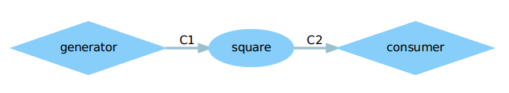
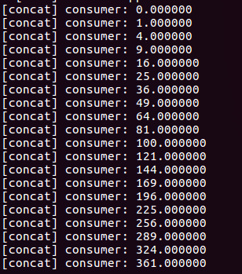
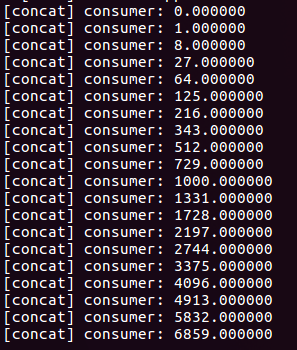
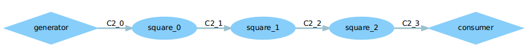
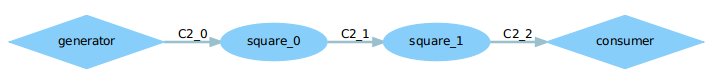
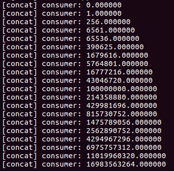
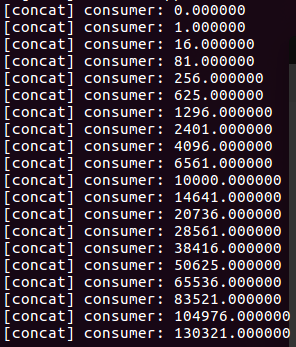
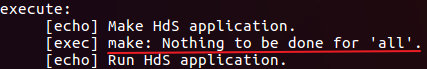

# DOL实例分析&编程
## 任务1
修改example1，使其输出3次方数  

这里涉及的代码文件为`square.c`:  

```c
#include <stdio.h>
#include "square.h"

void square_init(DOLProcess *p) {
    p->local->index = 0;
    p->local->len = LENGTH;
}

int square_fire(DOLProcess *p) {
    float i;

    if (p->local->index < p->local->len) {
        DOL_read((void*)PORT_IN, &i, sizeof(float), p);
        i = i*i;// 这里修改代码
        DOL_write((void*)PORT_OUT, &i, sizeof(float), p);
        p->local->index++;
    }

    if (p->local->index >= p->local->len) {
        DOL_detach(p);
        return -1;
    }

    return 0;
}
```

可以观察到`square`模块将输入`i`转化为`i*i`输出,那么只要将代码里的`i*i`改为`i*i*i`即可让其输出3次方.  

修改前后`*.dot`图没有改变:  

   

- 运行结果(修改前):  

    

- 运行结果(修改后):  

    

---
## 任务2
修改example2，让3个square模块变成2个  

主要修改的文件为`.../dol/examples/example2`路径下的`example2.xml`文件:  

```xml
<?xml version="1.0" encoding="UTF-8"?>
<processnetwork xmlns="http://www.tik.ee.ethz.ch/~shapes/schema/PROCESSNETWORK" xmlns:xsi="http://www.w3.org/2001/XMLSchema-instance" xsi:schemaLocation="http://www.tik.ee.ethz.ch/~shapes/schema/PROCESSNETWORK
http://www.tik.ee.ethz.ch/~shapes/schema/processnetwork.xsd" name="example2"> 
  <!-- 这里修改 -->
  <variable value="3" name="N"/>

  <!-- instantiate resources -->
  <process name="generator">
    <port type="output" name="10"/>
    <source type="c" location="generator.c"/>
  </process>

  <iterator variable="i" range="N">
    <process name="square">
      <append function="i"/>
      <port type="input" name="0"/>
      <port type="output" name="1"/>
      <source type="c" location="square.c"/>
    </process>
  </iterator>
<!-- 省略后面代码 -->
```

观察可以看出，该配置文件说创建的`square`模块一共有`N`个,这里的`N`是文件开头部分`variable`标签定义的变量,因此只要将其`value`属性由`3`改为`2`即可.

- 修改前`*.dot`图:  

     

- 修改后`*.dot`图:   

    

- 修改前运行结果:  

    

- 修改后运行结果:  

     

---
##关于编译
本次实验中,编译运行DOL例子是在`.../dol/build/bin/main`路径下进行的.运行命令:    
```bash
ant -f runexample.xml -Dnumber=1 #number=1指定运行的例子为example1
```
但是,在实际编译过程中,发现修改`.../dol/examples/example1`路径下的代码后，运行上面 命令发现程序运行结果没有发生改变.通过观察编译命令执行过程的输出,发现在ant编译执行的最后一个target:`execute`有如下输出:  
  

再查看`runexample.xml`的相关代码:   

```xml
<!-- create and run SystemC application -->
  <target name="execute">
    <!-- 此处省略不相关代码 -->
    <echo message="Make ${generator} application."/>
    <exec executable="make" dir="example${number}/${generator}/src"/>

    <echo message="Run ${generator} application."/>
    <!-- 此处省略不相关代码 -->
  </target>
```

发现ant刚好是在`.../dol/build/bin/main/example1/Hds/src`路径下执行`make`命令.而上面的输出说明make在此时并没有编译任何东西,其原因也很明显,即上一次编译过程留下的可执行 文件已经存在,导致make不再重新编译.在这里,我们能想到的正常解决思路就是在make执行之前先执行`make clean`,把之前编译留下的可执行文件删掉,因此,在`runexample.xml`文件中合适的位置添加`make clean`命令即可:  

```xml
<!-- create and run SystemC application -->
  <target name="execute">
    <!-- 此处省略不相关代码 -->
    <echo message="Make ${generator} application."/>
    <!-- 执行make clean -->
    <exec executable="make" dir="example${number}/${generator}/src">
        <arg line="clean"/>
    </exec>
    <!-- 执行make -->
    <exec executable="make" dir="example${number}/${generator}/src"/>

    <echo message="Run ${generator} application."/>
    <!-- 此处省略不相关代码 -->
  </target>
```


---
## 实验感想
本次实验比较简单，在理解了DOL的例子的编程模型后，修改代码便不会遇到什么问题了。不过，在本次实验中遇到的主要问题是编译问题,解决方法在上文已经说明了.