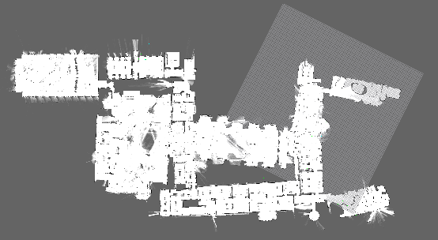
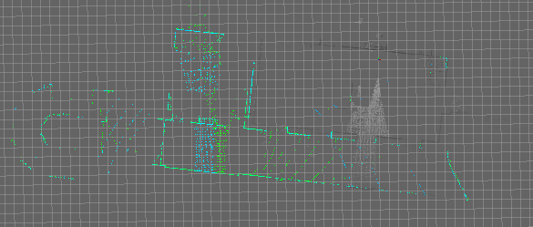
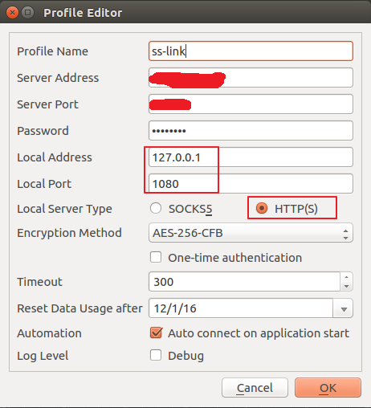
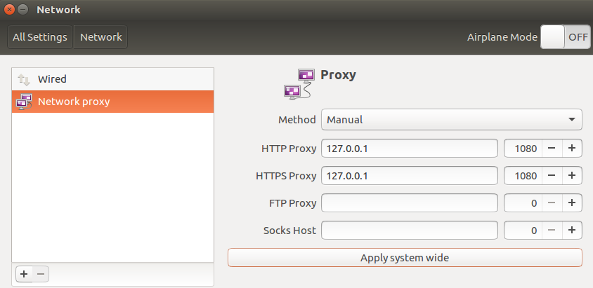

# 配置cartographer

---

本次ROS下安装cartographer是在Ubuntu16.04 64位下进行的,在此之前已经安装好了**ROS Kinetic**.

## 编译和安装

谷歌官方推荐使用工具[wstool](http://wiki.ros.org/wstool)和[rosdep](http://wiki.ros.org/rosdep),编译工具推荐使用[Ninja](https://ninja-build.org/).

1. 安装依赖

   安装`wstool`和`rosdep`  以及`ninja`编译工具

   ```bash
   sudo apt-get update
   sudo apt-get install -y python-wstool python-rosdep ninja-build
   ```

2. 创建`catkin_ws`工作目录(这里是在`home`路径下,其他路径也可以):

   ```bash
   mkdir catkin_ws
   cd catkin_ws
   wstool init src
   ```

3. 配置各种依赖项

   ```bash
   # Merge the cartographer_ros.rosinstall file and fetch code for dependencies.
   wstool merge -t src https://raw.githubusercontent.com/googlecartographer/cartographer_ros/master/cartographer_ros.rosinstall
   wstool update -t src

   # Install deb dependencies.
   rosdep init
   rosdep update
   rosdep install --from-paths src --ignore-src --rosdistro=${ROS_DISTRO} -y
   ```

4. 编译安装

   ```bash
   catkin_make_isolated --install --use-ninja # 在运行时因为需要从谷歌下载代码,因此运行这一步需要翻墙环境.
   source install_isolated/setup.bash
   source devel_isolated/setup.bash
   rospack profile # 如果运行时出现其他提示,可以选择再运行一次, 加上参数--zombie-only
   ```

## 运行demo

安装好cartographer后就可以下载谷歌官方提供的测试数据(包括2D和3D)来运行了.

1. 下载2D数据:

   ```bash
   wget -P ~/Downloads https://storage.googleapis.com/cartographer-public-data/bags/backpack_2d/cartographer_paper_deutsches_museum.bag
   ```

2. 运行2D数据:

   ```bash
   roslaunch cartographer_ros demo_backpack_2d.launch bag_filename:=${HOME}/Downloads/cartographer_paper_deutsches_museum.bag
   ```

3. 运行结果:  

     

4. 下载3D数据:  

   ```bash
   wget -P ~/Downloads https://storage.googleapis.com/cartographer-public-data/bags/backpack_3d/cartographer_3d_deutsches_museum.bag
   ```

5. 运行3D数据:

   ```bash
   roslaunch cartographer_ros demo_backpack_3d.launch bag_filename:=${HOME}/Downloads/cartographer_3d_deutsches_museum.bag
   ```

6. 3D数据运行结果(由于电脑配置不行,因此跑的时间不长):  

   俯视图:  

     

   3d视角:  

     


---

## 关于Ubuntu下翻墙

本次实验配置在最后的`catkin_make_isolated`编译时需要从谷歌下载代码,在墙内环境下如果不翻墙的话会出下**fail**.这里使用shadowsocks翻墙.  

1. 安装**shadowsocks**,这里安装**qt5**客户端,能够自动转**http(s)**代理.

   ```bash
   sudo add-apt-repository ppa:hzwhuang/ss-qt5
   sudo apt-get update
   sudo apt-get install shadowsocks-qt5
   ```

2. 配置**shadowsocks**客户端:

   搜索`ss-qt5`,打开图形客户端，添加配置，示例如下,注意本地服务器类型需要选择`HTTP(S)`.  

      

3. 配置系统级代理,打开`系统设置`->`网络`,设置如下:   

     

> **注意**: 配置完代理后,终端要重启后代理才会生效.

**参考链接**:
- [Cartographer ROS Integration(谷歌官方安装文档)](https://google-cartographer-ros.readthedocs.io/en/latest/)
- [shadowsock-qt5文档](https://github.com/shadowsocks/shadowsocks-qt5/wiki)  
